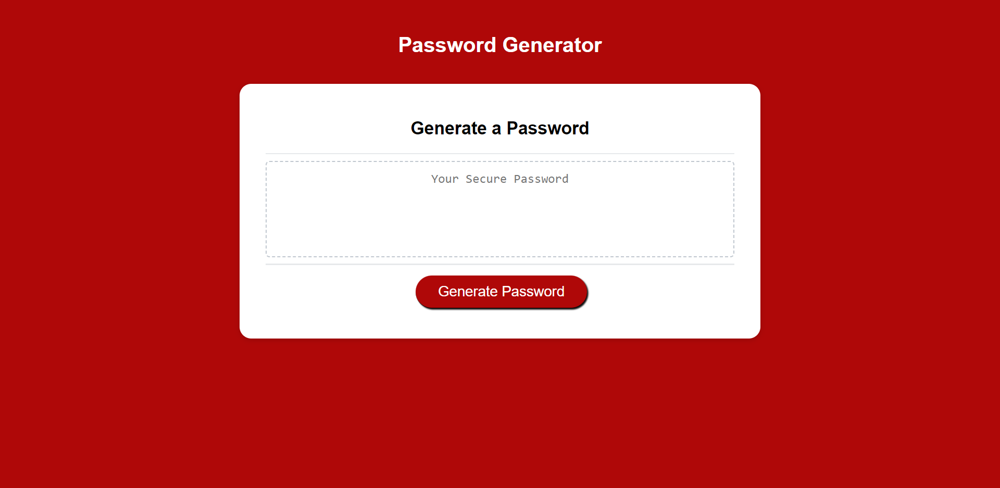

# Password Generator

## Project Description 

This project involved modifying a Password Generator that enables employees to generate random passwords based on criteria that they've selected. 

Below is a summary of the changes/additions that have been made to Javascript file.

* Function that generates a random passowrd based on criteria selected for the characters. 

* "Generate Password" Button turns black once hovered over and stays black if clicked.

* Validation prompts that allow users to determine their password criteria:

*     Password length must be between 8 and 128 characters. 
*     At least one from the following must be selected for the characters; lowercase letters, uppercase letters numeric values and special characters. 

* Validation alerts when the above criteria are not met and a prompt to re-select.

* Displayed password is cleared once the "Generate Password" button is clicked again.

# Usage

1. In order to run the application, click on the deployed application link.

2. Once you have been redirected to the web-page, click on the red "Generate Password" button.

3. You will be prompted with a series of questions regarding your password criteria (note, at least one must be selected, and the password length must be between 8 and 128 characters.)

4. When all prompts are answered, you will be provided with a password on your screen which is generated according to your responses.

# Links
[Click here to access the deployed website.](https://fadumaabdi.github.io/passwordGenerator/index.html)

[Click here to access the files on the github repository.](https://github.com/fadumaabdi/passwordGenerator)

